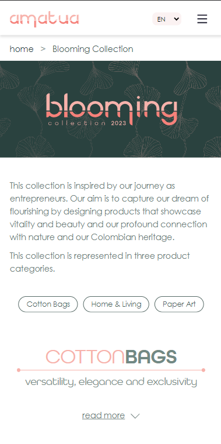
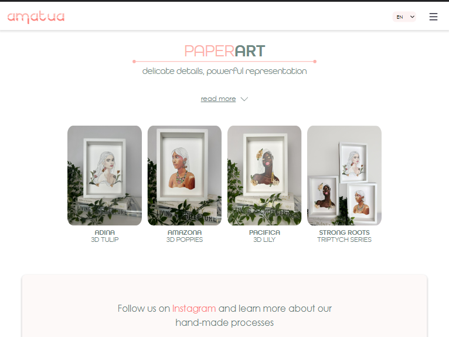
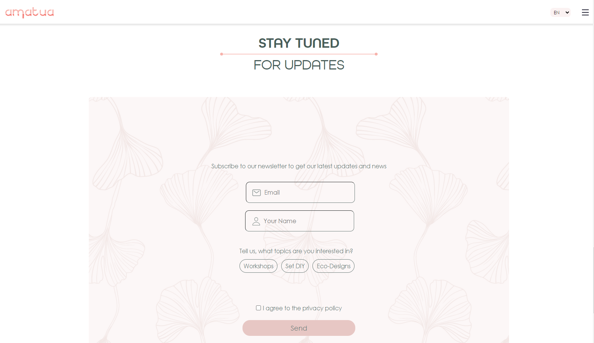

# Final-Project: Amatua Produktkatalog

## Copyright des Inhalts und der Bilder liegen bei dem Unternehmen Amatua
Copyright 2023 by © Amatua

# Impressum
- Amatua
- Rixdorfer Straße 80
- 12109 Berlin
- Phone: +49 15214674797
- Email: amatua.berlin@gmail.com

### Dieses Projekt diente uns als Finales Projekt, für unsere Weiterbildung als Full Stack Web Developer bei DCI, zum Lernen und nicht zum kommerziellen Zweck.

## Team Amatua
#### Projektleitung [Catalina Fonseca Silva](https://github.com/CatalinaF-S)
#### Scrum Master [Anton Lust](https://github.com/AntonLust)
#### Frontend Lead [Lina Lubig](https://github.com/lina-DCI)
#### Backend Lead [Boris Dimitriev](https://github.com/BorisDmitriev)
#### Git Master [Nancy Klemm](https://github.com/NancyKlemm)

## Das Projekt

### Der Kunde
- Kolumbianische Unternehmerinnen
- Handgefertigte Kunst aus Berlin
- bewusst, nachhaltig und hochwertig

### Der Auftrag
- Produktdarstellungen (Produktkatalog, wessen Produkte auf die Etsyseite des Kunden verlinken)
- Kontaktmöglichkeiten (Newsletteranmeldung mit Sendgridanbindung)
- Übersetzungen in 3 Sprachen (DE, EN, ES)

## Technologien

### Project Planning
- Excel
- Github Projects

### Prototyping
- Figma

### Frontend
- HTML
- CSS/SCSS
- React.js 
- Bootstrap
- i18next

### Backend
- Express.js
- MongoDB
- Sendgrid

## Preview
### Mobile 

### Tablet 

### Desktop

## Deployment
- render.com
- cyclic.sh
- [Amatua](https://amatua-catalog.onrender.com/)
